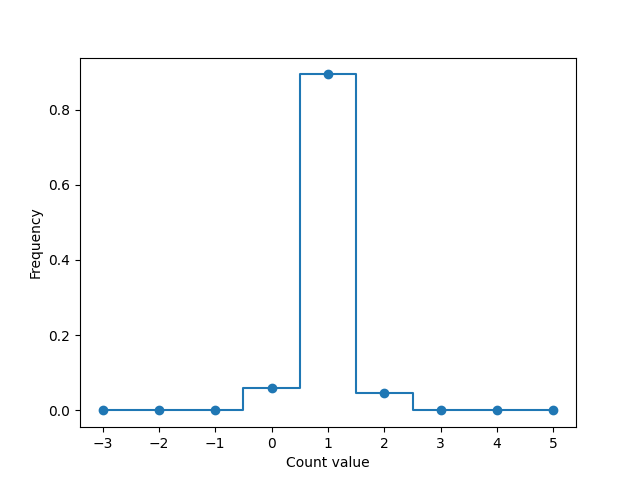

# Part 1: Plain Aggregates and Privacy

## Question 1:

_Look at the result of this count query. Note that it does not include any name, email, or other personally identifiable information. What can you nevertheless learn about the TA's musical tastes? What possible genres might they have chosen? Alternatively, what genres is it impossible for them to have chosen?_

I'm assuming that the TAs are older than the general student population. Ad such, I would expect them to be 26 or older.
It would seem, then, that Kinan prefers either: Metal, Rock, Pop (highly likely that it is metal), or classical or house (which are the entries with 0 age).
From this deduction, we can also infer that Kinan definitely does not listen to Country.

## Question 2:

_What did you find out about the TA? Are your findings consistent with Question 1? Combine the two together to learn the TA's exact age._

On Kinan's website: "When I am not on my Computer, I am probably at a Metal show, grilling in the backyard, or drinking some beer." This implies that Kinan does listen to Metal, so he is likely 29 or 30.

## Question 3:

_Identify the TA's favorite color. What is it? How easy or obvious is this to do, and why?_

Kinan's favorite color is one of black, yellow or blue. This is relativley straightforward to do since the colors have been grouped by age. However, since I'm not entirely certain about the age, there are more color preference possibilities. More likely than not, Kinan is the oldest person in the class so his favorite color is Blue.

## Question 4:

_What information can you learn about the TA's favorite sport from the above query?_

From the results, Kinan could prefer any one of Baseball, basketball, E sports, or soccer. However, I am inclined to think he chose baseball since he mentioned liking the Red Sox on the website.

## Question 5:

_What is our TA's favorite sport?_

If Kinan is either 29 or 30 now, last year, he would have still been in the 25+ category. Interestingly, there is no baseball here!

So, Kinan must be interested in the intersection of the sports mentioned in Answer 4 and the answers from last year: football, soccer, and e sports. This means one of soccer or E sports.

Now, looking at the fine-grained table grouped by age rather than age group, we see that the only possible answer is soccer.

Update: according to Ed, the data has been updated to reflext Baseball as the right answer. (The analysis is omited since the method is the same as written above).

# Part 2: Implementing Differential Privacy

## Question 6:

_Run dp.py several times varying the epsilon privacy parameter for different values between 10 and 0.01. What happens when the privacy parameter grows larger or smaller? How does that affect privacy?_

Assuming constant sensitivity, the larger the epsilon, the lesser the data jitter becomes, i.e., the values are closer to the true aggregated alues.

We see this in the images `dp-plot-{epsilon}.png`

## Question 7:

_Look at the plot generated with privacy parameter epsilon = 0.5. What is the most likely value? What is the expected (i.e., average) value? How do they relate to the actual value (i.e., the query excuted without any noise via client.py)? How does the plot change for different values of the privacy parameter?
Please include the generated plot for epsilon = 0.5 in your submission._

The most common value (and the average) when epsilon = 0.5 for the first row in the histogram is 1. This is equal to the actual value. As epsilon decreases, the distribution spreads out centered around 1 with a lower max frequency peak. Given enough iterations of the histogram creation, this looks like a gaussian distribution centered around teh true value.

# Part 3: Differential Privacy and Composition

## Question 8:

_Question 8: Run the composition attack against the average age grouped by programming experience. What can you deduce from the exposed averages about the programming experience level of our TA? How confident are you in what you have deduced? Are there scenarios where they might be wrong?_

Looking at the results from part 1:

By averaging the jittered averages, we are able to completely reproduce and expose the true averages.
I'm quite confident since the historgram pre-jitter and after exposing the averages is identical. The exposed averages should theoretically only be wrong if the number of iterations is decreased from 200 below a certain threshold, but this is dependent directly on whether the jitter is gaussian or not (which in this case it is).

Looking at the programming experience averages:

In my opnion, it's quite difficult to determine how much progamming experience Kinan has. It could be >10 or 8-10 seeing that those values have higher averages with the fewest number of counts in that category. Specifically, I would count on Kinan being in the >10 category since the only way the average is 28 is if Kinan, who is 30, was averaged with three other individuals (the count I exposed was 4) of higher ages between 24 and 29.

The reason this problem is tricky is because It is possible for Kinan's coding experience to also be 5-8 years since the average is 23 but there's a much higher count of 16 - so the mean would be shifted considerably more to the right had Kinan's value been accounted for (this is speculation).

## Question 9:

_Reuse your composition attack from question 8 to compute the exact non-noised counts per programming experience level. Deduce the programming experience level of our TA, with high confidence, by looking at both the exposed counts and the previously exposed averages. Now summarize everything you've learned about the TA!_

Looking at the true counts of count0 with programming, we see that the real count is really 3 for 8-10 years, not 4. This makes it quitely likely in my opinion that Kinan either has >10 years of experience or 5-8, since for three samples to average to 23, the two numbers must be much smaller than the lowest recorded age (19) when averaging with Kinan's age (possibly 30).

I would argue that, from my research online, Kinan has been doing CS for a while, so I would go with Kinan having 10+ years of experience.

# Question 10:

_Does the class you implemented suffice to truly enforce that a dataset is never used beyond a certain privacy budget? Can developers intentionally or unintentionally over-use the dataset beyond the privacy budget? At a very high level, how would you design a different privacy budget enforcment mechanism that does not suffer these drawbacks?_

The class suffices only suffices if we assume that malicious developers are only exposed to the Budget wrapper API, and not to the individual avg, count and count0 APIs. Even then, however, developers could just specify an inifinite budget and thereby query the dataset infinitely.

One issue with the current system is that the exhausted privacy resets every time the runtime is disconnected. A better system would have some way of persisting the exhausted privacy budget, perhaps by storing it to disk (on-device).
